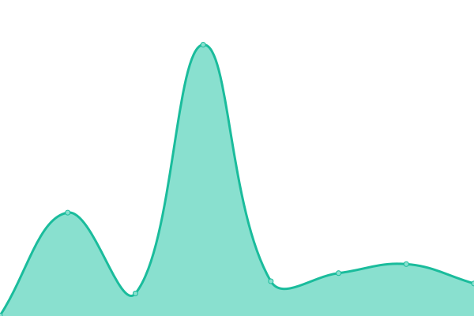
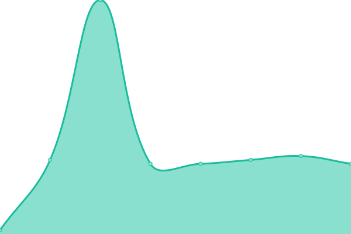

# [📈 Live Status](https://demo.upptime.js.org): <!--live status--> **🟧 Partial outage**

This repository contains the open-source uptime monitor and status page for [Adomi Delivery](https://adomi.app/), powered by [Upptime](https://github.com/upptime/upptime).

With [Upptime](https://upptime.js.org), you can get your own unlimited and free uptime monitor and status page, powered entirely by a GitHub repository. We use [Issues](https://github.com/Adomi-Delivery/adomi-status/issues) as incident reports, [Actions](https://github.com/Adomi-Delivery/adomi-status/actions) as uptime monitors, and [Pages](https://demo.upptime.js.org) for the status page.

<!--start: status pages-->
<!-- This summary is generated by Upptime (https://github.com/upptime/upptime) -->
<!-- Do not edit this manually, your changes will be overwritten -->
<!-- prettier-ignore -->
| URL | Status | History | Response Time | Uptime |
| --- | ------ | ------- | ------------- | ------ |
|  [Adomi Website (WWW)](https://www.adomi.app) | 🟩 Up | [adomi-website-www.yml](https://github.com/Adomi-Delivery/adomi-status/commits/HEAD/history/adomi-website-www.yml) | 

 437ms
     
 | 

<a href="https://Adomi-Delivery.github.io/adomi-status/history/adomi-website-www">100.00%</a>
    

|  [Adomi Website (@)](https://adomi.app) | 🟩 Up | [adomi-website.yml](https://github.com/Adomi-Delivery/adomi-status/commits/HEAD/history/adomi-website.yml) | 

 420ms
     
 | 

<a href="https://Adomi-Delivery.github.io/adomi-status/history/adomi-website">100.00%</a>
    

|  [Adomi QR (WWW)](https://www.adomiqr.com) | 🟩 Up | [adomi-qr-www.yml](https://github.com/Adomi-Delivery/adomi-status/commits/HEAD/history/adomi-qr-www.yml) | 

 440ms
     
 | 

<a href="https://Adomi-Delivery.github.io/adomi-status/history/adomi-qr-www">100.00%</a>
    

|  [Adomi QR (@)](https://adomiqr.com) | 🟩 Up | [adomi-qr.yml](https://github.com/Adomi-Delivery/adomi-status/commits/HEAD/history/adomi-qr.yml) | 

 428ms
     
 | 

<a href="https://Adomi-Delivery.github.io/adomi-status/history/adomi-qr">100.00%</a>
    

|  [Dashboard Admin](https://admin.adomi.app) | 🟩 Up | [dashboard-admin.yml](https://github.com/Adomi-Delivery/adomi-status/commits/HEAD/history/dashboard-admin.yml) | 

 178ms
     
 | 

<a href="https://Adomi-Delivery.github.io/adomi-status/history/dashboard-admin">100.00%</a>
    

|  [Dashboard Aliados](https://aliados.adomi.app) | 🟩 Up | [dashboard-aliados.yml](https://github.com/Adomi-Delivery/adomi-status/commits/HEAD/history/dashboard-aliados.yml) | 

 145ms
     
 | 

<a href="https://Adomi-Delivery.github.io/adomi-status/history/dashboard-aliados">100.00%</a>
    

|  [Ordenes Web](https://ordenes.adomi.app) | 🟩 Up | [ordenes-web.yml](https://github.com/Adomi-Delivery/adomi-status/commits/HEAD/history/ordenes-web.yml) | 

 126ms
     
 | 

<a href="https://Adomi-Delivery.github.io/adomi-status/history/ordenes-web">100.00%</a>
    

|  [Adomi Shop (www)](https://www.adomi.shop) | 🟥 Down | [adomi-shop-www.yml](https://github.com/Adomi-Delivery/adomi-status/commits/HEAD/history/adomi-shop-www.yml) | 

 221ms
     
 | 

<a href="https://Adomi-Delivery.github.io/adomi-status/history/adomi-shop-www">0.00%</a>
    

|  [Adomi Shop (@)](https://adomi.shop) | 🟩 Up | [adomi-shop.yml](https://github.com/Adomi-Delivery/adomi-status/commits/HEAD/history/adomi-shop.yml) | 

 427ms
     
 | 

<a href="https://Adomi-Delivery.github.io/adomi-status/history/adomi-shop">100.00%</a>
    

|  [SOAT Shop (www)](http://www.soat.shop) | 🟩 Up | [soat-shop-www.yml](https://github.com/Adomi-Delivery/adomi-status/commits/HEAD/history/soat-shop-www.yml) | 

 88ms
     
 | 

<a href="https://Adomi-Delivery.github.io/adomi-status/history/soat-shop-www">100.00%</a>
    

|  [SOAT Shop (@)](http://soat.shop) | 🟩 Up | [soat-shop.yml](https://github.com/Adomi-Delivery/adomi-status/commits/HEAD/history/soat-shop.yml) | 

 19ms
     
 | 

<a href="https://Adomi-Delivery.github.io/adomi-status/history/soat-shop">100.00%</a>
    

|  [Openpay Sandbox](https://sandbox-api.openpay.co) | 🟩 Up | [openpay-sandbox.yml](https://github.com/Adomi-Delivery/adomi-status/commits/HEAD/history/openpay-sandbox.yml) | 

 375ms
     
 | 

<a href="https://Adomi-Delivery.github.io/adomi-status/history/openpay-sandbox">100.00%</a>
    

|  [Adomi Core (MS)](https://us-central1-adomi-dev.cloudfunctions.net/core/api/v1) | 🟩 Up | [adomi-core-ms.yml](https://github.com/Adomi-Delivery/adomi-status/commits/HEAD/history/adomi-core-ms.yml) | 

 119ms
     
 | 

<a href="https://Adomi-Delivery.github.io/adomi-status/history/adomi-core-ms">100.00%</a>
    

|  [Adomi Orders (MS)](https://us-central1-adomi-dev.cloudfunctions.net/OrderMs) | 🟥 Down | [adomi-orders-ms.yml](https://github.com/Adomi-Delivery/adomi-status/commits/HEAD/history/adomi-orders-ms.yml) | 

 1528ms
     
 | 

<a href="https://Adomi-Delivery.github.io/adomi-status/history/adomi-orders-ms">99.99%</a>
    

|  [Adomi Environment (MS)](https://us-central1-adomi-dev.cloudfunctions.net/InitHandler/environment) | 🟥 Down | [adomi-environment-ms.yml](https://github.com/Adomi-Delivery/adomi-status/commits/HEAD/history/adomi-environment-ms.yml) | 

 1359ms
     
 | 

<a href="https://Adomi-Delivery.github.io/adomi-status/history/adomi-environment-ms">99.99%</a>
    

|  [Adomi Payment (MS)](https://us-central1-adomi-dev.cloudfunctions.net/payment) | 🟩 Up | [adomi-payment-ms.yml](https://github.com/Adomi-Delivery/adomi-status/commits/HEAD/history/adomi-payment-ms.yml) | 

 89ms
     
 | 

<a href="https://Adomi-Delivery.github.io/adomi-status/history/adomi-payment-ms">100.00%</a>
    

|  [Adomi Insurance (MS)](https://us-central1-adomi-dev.cloudfunctions.net/insurance) | 🟩 Up | [adomi-insurance-ms.yml](https://github.com/Adomi-Delivery/adomi-status/commits/HEAD/history/adomi-insurance-ms.yml) | 

 154ms
     
 | 

<a href="https://Adomi-Delivery.github.io/adomi-status/history/adomi-insurance-ms">100.00%</a>
    

|  [Adomi Wallet (MS)](https://us-central1-adomi-dev.cloudfunctions.net/wallet) | 🟩 Up | [adomi-wallet-ms.yml](https://github.com/Adomi-Delivery/adomi-status/commits/HEAD/history/adomi-wallet-ms.yml) | 

 236ms
     
 | 

<a href="https://Adomi-Delivery.github.io/adomi-status/history/adomi-wallet-ms">100.00%</a>
    

|  [Adomi Alerts (MS)](https://us-central1-adomi-dev.cloudfunctions.net/alerts/api/v1) | 🟩 Up | [adomi-alerts-ms.yml](https://github.com/Adomi-Delivery/adomi-status/commits/HEAD/history/adomi-alerts-ms.yml) | 

 253ms
     
 | 

<a href="https://Adomi-Delivery.github.io/adomi-status/history/adomi-alerts-ms">100.00%</a>
    

|  [Adomi Location (MS)](https://us-central1-adomi-dev.cloudfunctions.net/location/api/v1) | 🟩 Up | [adomi-location-ms.yml](https://github.com/Adomi-Delivery/adomi-status/commits/HEAD/history/adomi-location-ms.yml) | 

 74ms
     
 | 

<a href="https://Adomi-Delivery.github.io/adomi-status/history/adomi-location-ms">100.00%</a>
    

|  [Adomi Polygons (MS)](https://us-central1-adomi-dev.cloudfunctions.net/polygons/api/v1/city-polygons/by-city-id/c1e4bcc9-eb84-4653-872c-e38f8de4bf79) | 🟥 Down | [adomi-polygons-ms.yml](https://github.com/Adomi-Delivery/adomi-status/commits/HEAD/history/adomi-polygons-ms.yml) | 

 1355ms
     
 | 

<a href="https://Adomi-Delivery.github.io/adomi-status/history/adomi-polygons-ms">100.00%</a>
    

|  [Adomi Reports (MS)](https://us-central1-adomi-dev.cloudfunctions.net/reports/api/v1/reports/count-register-users) | 🟩 Up | [adomi-reports-ms.yml](https://github.com/Adomi-Delivery/adomi-status/commits/HEAD/history/adomi-reports-ms.yml) | 

 230ms
     
 | 

<a href="https://Adomi-Delivery.github.io/adomi-status/history/adomi-reports-ms">100.00%</a>
    

<!--end: status pages-->

[**Visit our status website →**](https://demo.upptime.js.org)

## 📄 License

- Powered by: [Upptime](https://github.com/upptime/upptime)
- Code: [MIT](./LICENSE) © [Adomi Delivery](https://adomi.app/)
- Data in the `./history` directory: [Open Database License](https://opendatacommons.org/licenses/odbl/1-0/)
